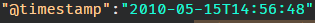
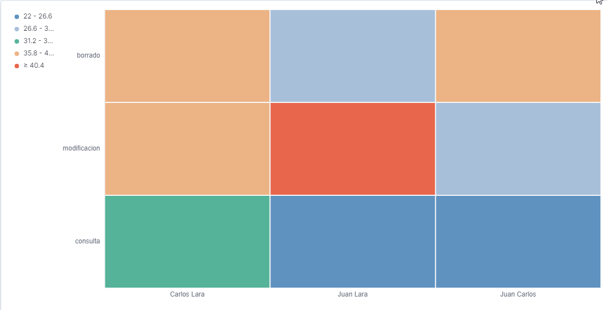
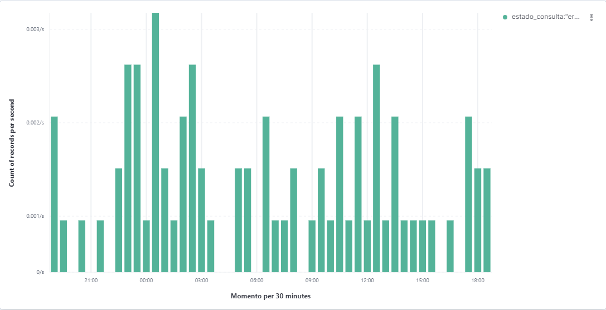

# Visualizaciones

## Problema

Despues de haber indagado mucho en la documentacion de elastic y de comprobar en donde podria estar el error, descubri que efectivamente el inconveniente se encontraba en la parte del filtro de tiempo en Kibana, y es que el error que cometi fue suponer que los registros se guardaban en el tiempo en el que se agregaba, ignorando el atributo de _@timestamp_.

## Solucion
Una vez sabiendo que los registros se guardaban segun el valor de timestamp la solucion fue ajustar el filtro de tiempo de kibana para que coincidieran con el atributo *@timestamp* y se soluciono.

## Vistas

Para concluir la practica solo bastaba obtener las vistas indicadas.

La primera de ellas era un gráfica Heat map donde se deben mostrar el numero de servicios realizados por administrador

La segunda indicacion era realizar una gráfica de barras donde se mostraran los registros del atributo *estado_consulta* que contengan el valor "error" 

